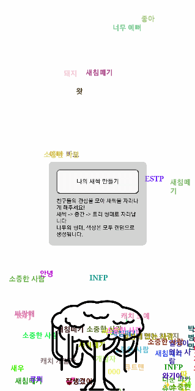

# About Me🌱

친구들이 생각하는 나는 어떤 사람일까? 친구들의 마음이 모여 나의 새싹을 키워보세요!

[AboutMe](https://aboutme2.web.app/)

## 컨셉🌿

나에 대한 친구들의 생각들이 비가 되어 새싹을 자라나게 합니다.

20개, 50개가 되었을 때 새싹이 자라납니다.

## 개발 환경🖥

Nuxt 3.6.1  
Node 18.13.0  
yarn 1.22.19  
nitro 2.5.2

## 실행 방법🎮

`yarn install`

`yarn dev`

\*\*service-account.json 필요

## 배포 방법🌈

`yarn deploy`

## 참고

이미지출처: [https://www.iconfinder.com/](https://www.iconfinder.com/)
favicon생성: [https://favicon.io/](https://favicon.io/)
